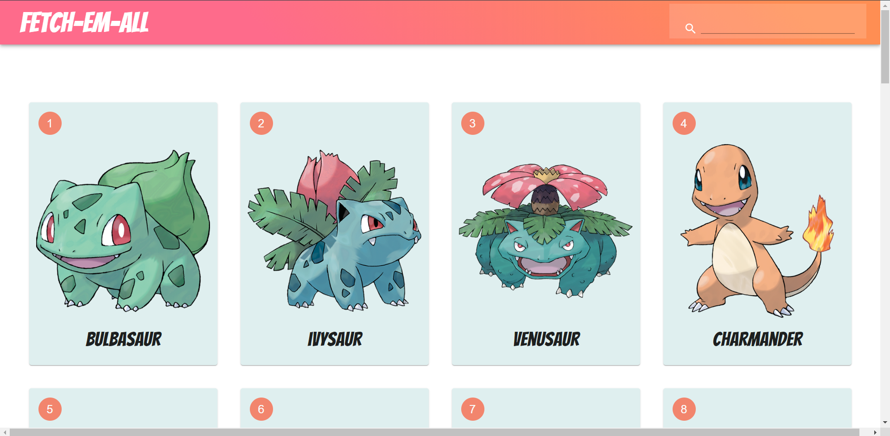
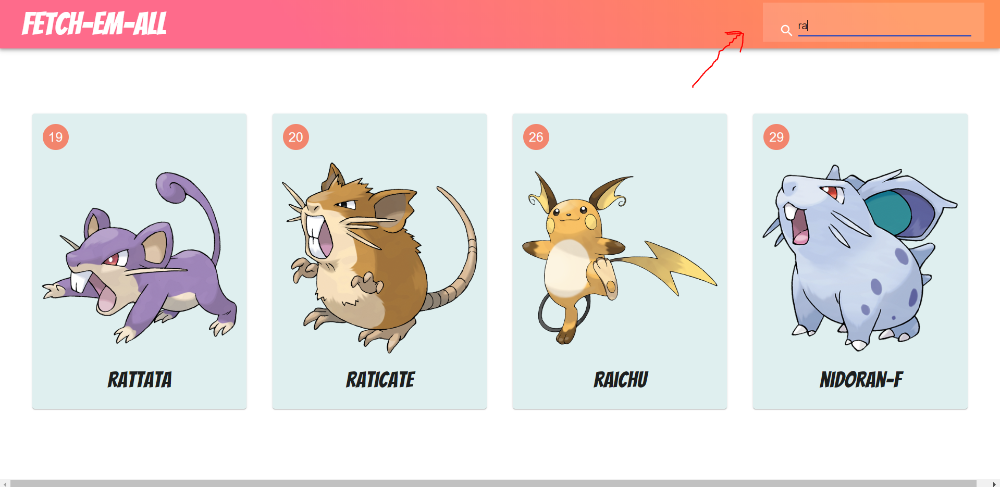
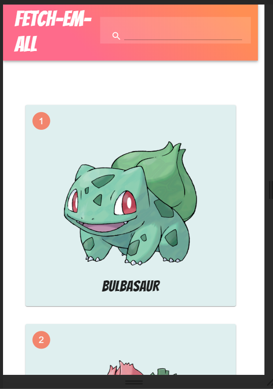
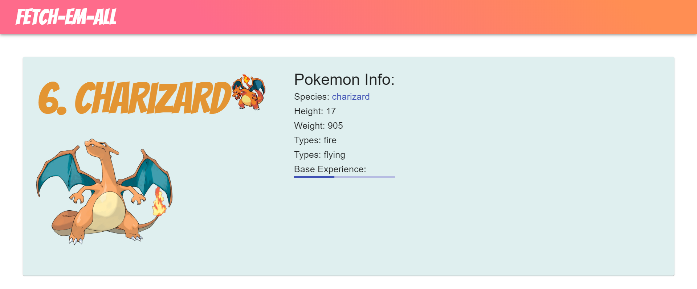

# fetch-em-all
This is a place to know about your pokemon.

> API makes my world easier. I ended up using
- Javascript (of course)
- React
- Material-ui

> API and Resource credit to
 @https://pokeapi.co/

> #### This is a fun little place where you can find all the pokemons.

> #### And you can search by name also.

> #### And its responsive too

> #### You can checkout their profile

